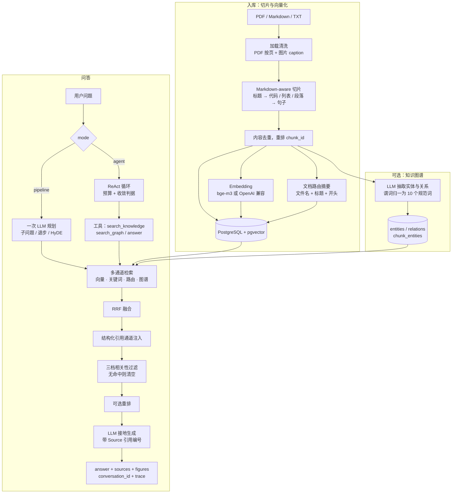

# NexusRAG

多文档知识库 RAG 问答系统。FastAPI + PostgreSQL/pgvector + Next.js，支持 **Agent 自主多轮** 与 **单轮多通道管线** 两种检索范式，内置可复现的检索/答案级评测层。

项目的重点不只是功能清单，而是**评测驱动的取舍**：每条检索通道的开关都能用自建评测集做消融量化，而不是凭直觉保留（见 [评测](#评测)）。

---

## 核心能力

| 能力 | 说明 |
| --- | --- |
| **双范式问答** | `pipeline`（单轮多通道）/ `agent`（ReAct 自主多轮，带预算与收敛判据） |
| **混合检索** | 向量 + 关键词（jieba + 同义词组门控）+ 文档路由 + 知识图谱，RRF 融合 |
| **结构化引用** | 法条编号（`第二百三十条`）、页码（`第4页`）整段抽取 + 精确通道注入 |
| **防幻觉过滤** | 三档相关性过滤，无精确匹配且余弦低于阈值 → **返回空**而非硬答 |
| **多查询规划** | LLM function calling 一次规划：子问题分解 / 退步抽象 / HyDE 假想文档 |
| **重排 4 策略** | `rrf` / `cross`（BGE-reranker）/ `llm`（pointwise 打分）/ `colbert`（Late Interaction） |
| **知识图谱** | LLM 抽取实体关系 → 实体锚点 + ≤2 跳扩展 → 回落到切片，支持浏览与可视化 |
| **文档管理** | 内容哈希幂等上传、软删除/恢复、重切片预览、PDF 图片 caption 与按需取图 |
| **LLM 管理** | 数据库内多 provider 管理、一键激活/测试，失败原因归类并给出修改建议 |
| **评测层** | 自建评测集（人工 / 自动生成标注）+ Hit@K/MRR 消融 + LLM 判官（忠实度/正确性/未支撑论断） |
| **实时链路** | SSE 流式返回（stage / agent_step / sources / token / done），前端可中断 |

---

## 架构



**两种范式共用同一套检索装置**：`agent` 的 `search_knowledge` 工具内部调用的就是 pipeline 的 `two_stage_search + inject_ref_channel + _relevance_filter`，保证行为一致，不会出现「agent 模式搜出来的东西更脏」。

Agent 侧是纯编排层，不重造检索能力：任一致命错误都静默返回 `None`，由调用方退回单轮管线，并回传降级原因。硬预算为「步数 / LLM 调用数 / 墙钟 45s」三重上限，另有「连续两步无新增证据即收敛」的判据。

---

## 快速开始

### 前置条件

- Docker 容器 `postgres-db`（`pgvector/pgvector:pg15`），数据库 `nexus_rag` 已启用 `vector`、`pg_trgm` 扩展
- Python ≥ 3.11 + [uv](https://github.com/astral-sh/uv)
- Node.js + npm

### 安装

```bash
cp .env.example .env      # 填入 PostgreSQL / Embedding / LLM 配置
uv sync                   # Python 依赖
cd ui/web && npm install  # 前端依赖
```

### 运行

```bash
./run.sh            # 后端 :8000 + 前端 :3000
./run.sh backend    # 仅 FastAPI
./run.sh ui         # 仅 Next.js
```

后端启动时自动建表与索引（`documents` / `chunks` / `doc_index` / `conversations` / `entities` / `relations` / `eval_cases` …）。上传的源文件按内容哈希落在 `data/uploads/`。

本机默认配置（`.env`）用**本地 bge-m3**（1024 维，首次使用需已下载模型）与 DeepSeek 作为 LLM。

---

## 配置

### 环境变量

| 变量 | 默认 | 说明 |
| --- | --- | --- |
| `POSTGRES_HOST/PORT/DB/USER/PASSWORD` | `localhost:5432/nexus_rag/postgres` | 主库连接 |
| `POSTGRES_ADMIN_DB` | `postgres` | 建库时连的管理库 |
| `POSTGRES_POOL_MIN/MAX` | `1 / 10` | 进程内连接池大小 |
| `EMBEDDING_PROVIDER` | `openai` | `openai`（API）或 `local`（sentence-transformers，离线） |
| `EMBEDDING_API_KEY / _BASE_URL / _MODEL` | — / OpenAI / `text-embedding-3-small` | API 模式配置 |
| `LOCAL_EMBEDDING_MODEL` | `BAAI/bge-m3` | 本地模式模型 |
| `LOCAL_EMBEDDING_DEVICE` | 自动 | MPS OOM 时设 `cpu` |
| `EMBEDDING_DIMENSION` | local `1024` / 其他 `1536` | 向量维度，须与索引一致 |
| `LLM_API_KEY / _BASE_URL / _MODEL / _TIMEOUT` | — / OpenAI / `gpt-4o-mini` / `60` | 兜底 LLM（数据库无 active provider 时生效） |
| `LLM_MAX_RETRIES` / `LLM_RETRY_BASE_DELAY` | `2` / `0.5` | 瞬时错误（限流/超时/5xx）指数退避重试 |
| `VISION_MODEL` | 同 `LLM_MODEL` | PDF 图片 caption 用的视觉模型 |
| `RERANK_STRATEGY` | `rrf` | `rrf` / `cross` / `llm` / `colbert` |
| `RERANK_MODEL` | `BAAI/bge-reranker-v2-m3` | cross 策略模型（需本地已下载） |
| `COLBERT_MODEL` | `models/colbert` | colbert 策略模型目录 |
| `AUTO_BUILD_GRAPH` | 关 | 设 `1` 时文档入库后自动增量建图 |

> LLM 也可以在 UI「设置」页管理：数据库里 `active` 的 provider 优先于环境变量，无需重启。

### 检索特性开关

`POST /api/query` 的 `features` 字段（不传 = 默认集；显式传 = 只开列出的）：

| 特性 | 默认 | 说明 |
| --- | --- | --- |
| `routing` | ✅ | 两级路由：先定位目标文档，再文档内检索 |
| `keywords` | ✅ | jieba 关键词通道 + 同义词扩展 + 覆盖度门控 |
| `decompose` | ✅ | 复杂问题拆子问题（LLM 规划） |
| `stepback` | ✅ | 退步抽象问题（LLM 规划） |
| `hyde` | ✅ | 假想文档段落（LLM 规划） |
| `rewrite` | ❌ | 确定性查询改写（消融未验证增益，移出默认，可显式开启） |
| `rerank` | ❌ | 重排；需显式开启，可配请求级 `rerank_strategy` |
| `graph` | ❌ | 图谱通道；agent 模式下表示是否挂载 `search_graph` 工具 |

元数据过滤：`filters` 走 JSONB 包含，如 `{"page": 5}`、`{"figure": true}`。

---

## 评测

检索效果靠消融量化，不靠感觉。评测集与结果都存在数据库里，可以直接用 CLI 或前端「评测」页操作。

```bash
# 检索级消融（Hit@K / MRR，逐配置对比）
uv run python -m src.evaluation --k 5
uv run python -m src.evaluation --deterministic        # 只跑不调 LLM 的配置，两轮可复现
uv run python -m src.evaluation --origin manual        # 只看人工题（与合成题结论可能相反）
uv run python -m src.evaluation --agent                # 追加 agent 行 + 步数/LLM 调用/延迟

# 评测集维护
uv run python -m src.evaluation list
uv run python -m src.evaluation add "<问题>" '<文件名>:<切片号>'
uv run python -m src.evaluation seed-multihop          # 播种多跳题（幂等）

# 答案级评测（LLM 判官：忠实度 / 正确性 / 未支撑论断）
uv run python -m src.evaluation answers --limit 20 --label v1
```

评测集自带空表初始化，**首次使用请先自建评测例**（`add` 或脚本自动出题），再跑消融。指标口径：

- **检索级**：`Hit@K`（前 K 条是否命中标注切片）、`MRR`（命中排名倒数的均值）。
- **答案级**：`faithfulness`（论断是否被检索证据支撑）、`correctness`（与参考答案的一致性）、未支撑论断计数。
- **可复现性**：`--deterministic` 关闭一切 LLM 规划调用，两次运行结果逐例一致，用来区分「真实增益」与「模型方差」。
- **子集分离**：`origin` 区分人工题与自动生成题，二者结论可能方向相反，只看合计会得出错误的开关决策。

---

## API

统一前缀 `/api`。完整交互式文档：`http://localhost:8000/docs`。

### 问答

| 方法 | 路径 | 说明 |
| --- | --- | --- |
| `POST` | `/query` | 单轮问答，返回 answer + sources + figures + trace |
| `POST` | `/query/stream` | SSE 流式：`stage` / `agent_step` / `sources` / `token` / `done` / `error` |
| `GET` | `/conversations` | 会话列表 |
| `GET/DELETE` | `/conversations/{id}/messages` | 历史 / 清空 |

### 文档

| 方法 | 路径 | 说明 |
| --- | --- | --- |
| `POST` | `/upload` | 上传，按 SHA-256 幂等；命中软删除记录即恢复 |
| `POST` | `/ingest/{id}` | 触发入库（已 ready 则幂等跳过，可 `force=true`） |
| `GET` | `/documents` | 文档列表 |
| `GET` | `/documents/{id}/chunks` | 当前切片预览 |
| `POST` | `/documents/{id}/preview` | 按新 chunk 配置试切，不落库 |
| `POST` | `/documents/{id}/rechunk` | 重新切片并重嵌入 |
| `DELETE` | `/documents/{id}` | 软删除：回收索引，保留磁盘原件 |
| `GET` | `/documents/{id}/file` | 原件预览（PDF 支持 `#page=N`） |
| `GET` | `/documents/{id}/pages/{p}/images/{i}` | 按需取页内图片 PNG |
| `POST` | `/documents/{id}/build-graph` | 后台按文档增量建图（不 wipe 全库） |

### 图谱 / 评测 / 系统

| 方法 | 路径 | 说明 |
| --- | --- | --- |
| `GET` | `/graph/stats` · `/graph/search` | 统计 / 实体搜索 |
| `GET` | `/graph/entities/{id}` · `/graph/subgraph` | 实体详情（出入边 + 证据切片）/ 子图 |
| `GET/POST` | `/eval/cases` | 评测集读写 |
| `POST` | `/eval/run` | 跑消融矩阵 |
| `POST` | `/eval/seed` | 播种多跳评测例 |
| `GET` | `/health` | 数据库 + LLM 真实运行状态（含最近一次调用结果）+ embedding 配置 |
| `GET` | `/stats` | 文档数 / 切片数 / 向量维度 / 文本体积 |
| `GET/POST/DELETE` | `/llm/providers` | provider 增删查 |
| `POST` | `/llm/providers/{id}/activate` · `/test` | 激活 / 连通性测试（失败给归类原因与建议） |

---

## 前端

Next.js 16 + React 19 + Tailwind 4，工作区共 6 页：

- **概览** `overview` — 系统统计与健康状态
- **问答** `chat` — 双范式切换、特性开关、Agent 时间线、检索检视面板（trace）、SSE 流式
- **文档** `documents` — 上传/入库/重切、切片预览、原件与图片预览
- **图谱** `graph` — 实体搜索、子图可视化、证据回溯
- **评测** `eval` — 评测集管理与消融结果
- **设置** `settings` — LLM provider 管理与连通测试

---

## 项目结构

```
src/
  api/          FastAPI 应用、路由、Pydantic schema
  ingestion/    loaders（PDF/MD/TXT + 图片 caption）、splitter（Markdown-aware）、embedder
  llm/          LLM 客户端（重试/流式/function calling）、错误归类、运行时状态
  storage/      PostgreSQL + pgvector 访问层、连接池、建表
  retrieval.py  混合检索总入口：多查询规划、两级路由、RRF、引用注入、相关性过滤
  agent.py      Agentic 编排层：ReAct 循环、工具集、预算守卫、静默降级
  graph.py      图谱 P1：LLM 抽取、实体消解、≤2 跳图通道
  rerank.py     4 种重排策略
  evaluation.py 评测集 + Hit@K/MRR 消融 + 答案级评测执行
  judge.py      LLM 判官：忠实度 / 正确性
  eval_builder.py  从语料自动出题
ui/web/         Next.js 前端
scripts/        校准、归因、清理、冒烟脚本
tests/          227 个单元测试
docs/           设计文档、路线图
```

### 维护脚本

```bash
uv run python scripts/smoke_backend.py            # 无外部依赖的后端冒烟
uv run python scripts/calibrate_thresholds.py     # 扫描路由 / 图谱锚点阈值
uv run python scripts/analyze_keywords_channel.py # 关键词通道逐例归因
uv run python scripts/rerun_deterministic_ablation.py
uv run python scripts/dedupe_chunks.py            # 存量切片去重（会改写评测引用）
uv run python scripts/purge_documents.py          # 哈希回填 + 软删文档物理清理
uv run python scripts/build_eval_set.py           # 采样语料自动出题
```

图谱也可以直接走 CLI：

```bash
uv run python -m src.graph build             # 重建全库图谱
uv run python -m src.graph build --resume    # 续跑，跳过已连线切片
uv run python -m src.graph build --doc a.pdf # 只重建指定文档（可多次）
uv run python -m src.graph stats
uv run python -m src.graph reset
```

---

## 测试

```bash
uv run pytest
```

227 个测试，LLM / embedder 全部打桩，**离线可跑、不连数据库、不调外部服务**。关键逻辑（`_gate_keyword_rows`、RRF 量纲、相关性过滤、上传幂等、降级路径）都有对应测试。

---

## 已知边界

- **规划类通道不可复现**：`decompose` / `stepback` / `hyde` 每次调 LLM，两次消融结果可能全是方差；复现请用 `--deterministic`。plan 缓存未做。
- **判官是单模型自评**：0.1 量级的答案级差异需人工标注校准后再信。
- **`rerank` / `graph` 默认关**，未做深度调优；`colbert` / `cross` 需预先下载本地模型。
- **阈值与语料绑定**：相关性阈值、路由阈值、图谱锚点阈值、关键词门控比例都在开发语料上校准。**换语料或换 embedding 后需重跑 `scripts/calibrate_thresholds.py`**，否则闸门可能过松（放进噪声）或过紧（清空有效结果）。
- **关键词门控与同义词表需按语言维护**：当前同义词组面向中英文技术/法律语料，垂直领域需自行扩充。
- **路由通道待调优**：默认阈值下路由层常退回全局向量，校准后可能才真正生效。
